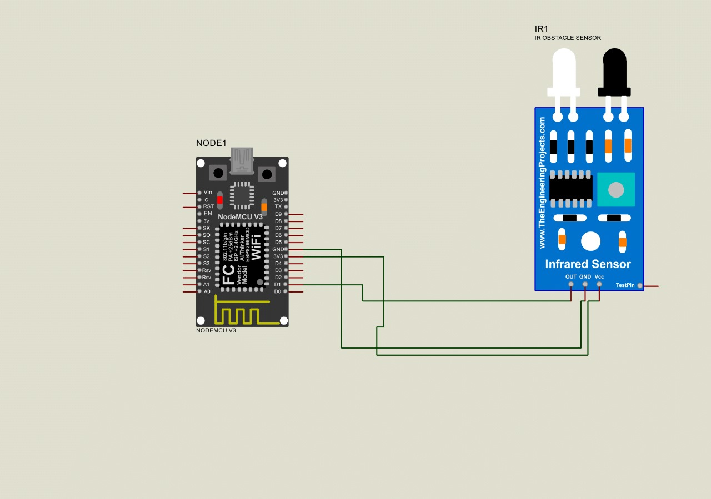

# IR-sensor-interface with NodeMCU ESP8266

This project demonstrates how to interface an IR (Infrared) sensor with NodeMCU ESP8266 microcontroller board. 
The NodeMCU ESP8266 reads data from the IR sensor and send it to a web server for visualization and monitoring.

- [Overview](#overview)
- [Hardware Requirements](#hardware-requirements)
- [Software Requirements](#software-requirements)
- [Connections](#wiring-diagram)
- [Circuit Diagram](#Circuit-diagram) 
- [Installation](#installation)

## Overview
In this project, an IR sensor is used to detect infrared radiation emitted by an object in its field of view. The NodeMCU ESP8266 captures the signal from the IR sensor and processes it to detect motion or any other relevant data. The captured data is then sent to a web server for further processing or visualization.

## Hardware Requirements

- NodeMCU ESP8266 development board
- IR sensor module (e.g., HC-SR501)
- Jumper wires
- Breadboard

## Software Requirements

- vscode (PlatformIO IDE )
- Proteus ( Proteus 8 Professional )
- NodeMCU board support for Arduino IDE
- Required libraries (e.g., ESP8266WiFi, ESP8266HTTPClient)

  ## Connections
  
- Connect the VCC pin of the IR sensor to 3.3V (or 5V) on NodeMCU ESP8266.
- Connect the GND pin of the IR sensor to GND on NodeMCU ESP8266.
- Connect the OUT pin of the IR sensor to GPIO pin D1 (GPIO5) on NodeMCU ESP8266.

  ## Circuit Diagram
  

  
  
